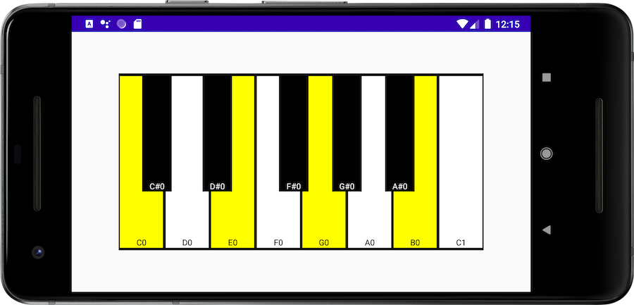

[](https://jitpack.io/#fluxtah/pianoroll)

# Piano Roll for Jetpack Compose

Piano roll is a small library written in Jetpack Compose to create chord sheets for keyboards and pianos.

```kotlin
class MainActivity : AppCompatActivity() {
    override fun onCreate(savedInstanceState: Bundle?) {
        super.onCreate(savedInstanceState)
        setContent {
            MaterialTheme {
                Box(
                    modifier = Modifier
                        .fillMaxWidth()
                        .fillMaxHeight(),
                    contentAlignment = Alignment.Center
                ) {
                    PianoRoll(
                        startNote = Note(PitchClass.C, 0),
                        endNote = Note(PitchClass.C, 1),
                        options = PianoRollOptions(
                            highlightedNotes = "C0 E0 G0 B0".chord
                        )
                    )
                }
            }
        }
    }
}
```

## How to get Piano Roll into your build:

### Step 1. Add the JitPack repository to your build file

```groovy
allprojects {
  repositories {
    ...
    maven { url 'https://jitpack.io' }
  }
}
```

### Step 2. Add the dependency

```groovy
dependencies {
  implementation 'com.github.fluxtah:pianoroll:2.0.0'
}
```

## Licence

```
Copyright 2020 Ian Warwick

Licensed under the Apache License, Version 2.0 (the "License");
you may not use this file except in compliance with the License.
You may obtain a copy of the License at

   http://www.apache.org/licenses/LICENSE-2.0

Unless required by applicable law or agreed to in writing, software
distributed under the License is distributed on an "AS IS" BASIS,
WITHOUT WARRANTIES OR CONDITIONS OF ANY KIND, either express or implied.
See the License for the specific language governing permissions and
limitations under the License.
```
